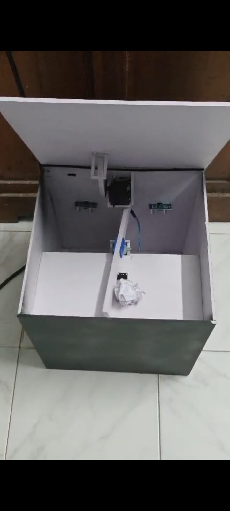
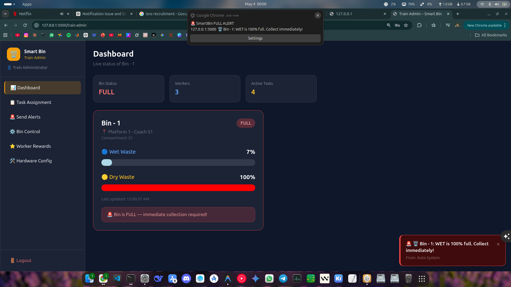
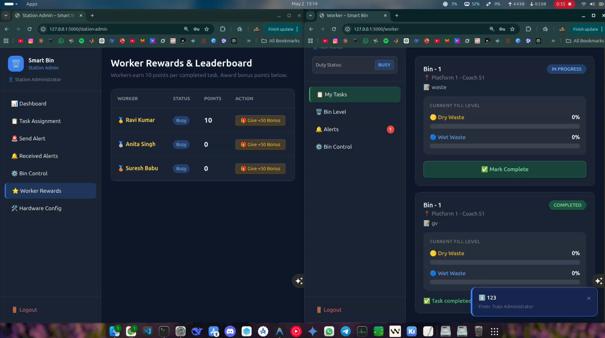

# Smart Dustbin IoT System

An advanced, automated smart waste management solution designed for real-time dry and wet waste segregation, monitoring, and collection coordination. Specifically tailored for dynamic, high-traffic environments like railway stations and train coaches, the system integrates intelligent ESP32-driven hardware sorting mechanisms with a robust multi-role web administration platform to eliminate manual sorting, optimize sanitation worker task assignment, and provide live telemetry dashboards.

---

## Key Features

- **Intelligent Automated Sorting**: Proximity-activated lid opening paired with automated moisture-sensing diverter mechanisms to physically segregate dry and wet waste into respective compartments.
- **Dual Wireless Communication**: Employs Bluetooth Low Energy (BLE) for direct local monitoring/configuration when nearby, seamlessly falling back to Wi-Fi HTTP REST APIs for continuous backend synchronization.
- **Multi-Role Administration Portals**: Dedicated, secure web interfaces for Train Administrators, Station Administrators, and Sanitation Workers featuring duty status toggles, real-time leaderboards, and direct bin overrides.
- **Granular Isolated Alert Tracking**: Implements per-user tracking logic ensuring critical fill-level alerts and administrative broadcasts are delivered and acknowledged independently across different active sessions.
- **Remote Hardware Calibration**: Over-the-air updates for stepper motor speeds, lid actuation timers, cooldown periods, and sensor thresholds directly via the web dashboard or BLE commands.
- **Comprehensive Hardware Simulator**: Includes a full-featured Python simulation environment (`simulate_esp32.py`) supporting multiple lifecycle scenarios (normal fill, rapid ramp, full cycle, and interactive manual testing) to test UI behavior without physical hardware.

---

## Hardware Prototype & System Interfaces

### Physical Dustbin Architecture
The physical unit consists of a custom dual-compartment enclosure equipped with:
- **Central Diverter Flap**: Actuated by a high-torque stepper motor to direct incoming items left or right based on sensor evaluation.
- **Proximity & Level Sensors**: Ultrasonic sensors detect approaching users to trigger the servo-controlled lid, while individual internal sensors monitor dry and wet bin fill percentages.
- **Moisture Classification**: An integrated soil moisture probe instantly differentiates wet waste from dry waste upon entry.

<div align="center">
  
  <p><em>Figure 1: Custom dual-compartment smart dustbin prototype featuring automated top lid, sorting servo diverter flap, and dual internal ultrasonic level sensors.</em></p>
</div>

### Web Management Dashboard
- **Admin Broadcasts & Task Control**: Administrators can send customized targeted alerts to workers or station managers, issue direct command overrides (e.g., maintenance lockouts, force-opening lids), and reward top-performing staff with leaderboard bonus points.
- **Sanitation Worker Interface**: Provides a streamlined layout detailing assigned collection tasks, specific coach/platform locations, live compartment fill gauges, and one-click task completion reporting.

<div align="center">
  
  <p><em>Figure 2: Train Administrator live dashboard showcasing custom targeted alert dissemination and critical full-state tracking logic.</em></p>
</div>

<div align="center">
  
  <p><em>Figure 3: Synchronized side-by-side view illustrating real-time gamified worker points leaderboards and continuous individual bin moisture/level gauges.</em></p>
</div>

---

## Tech Stack

- **Language**: Python 3.10+, C++ (Arduino Framework)
- **Backend Framework**: Flask 2.3+
- **Database**: SQLite3 utilizing thread-safe connection pooling and robust row-factory mappings
- **Frontend**: HTML5, Vanilla CSS (Custom dark-mode design system), Vanilla JavaScript (Asynchronous DOM updates and long-polling)
- **Microcontroller**: Espressif ESP32
- **Actuators & Sensors**: 
  - HC-SR04 Ultrasonic Proximity Sensors
  - Capacitive Soil Moisture Sensor
  - SG90 / MG995 Servo Motor (Lid mechanism)
  - 28BYJ-48 Stepper Motor with ULN2003 Driver Module (Sorting diverter)
- **Protocols**: Wi-Fi (HTTP REST POST/GET), Bluetooth Low Energy (GATT Server, Custom Service/Characteristics)

---

## Prerequisites

Ensure the following dependencies are installed on your local development system before proceeding:
- **Python**: Version 3.10 or newer
- **Git**: Command-line version control client
- **Package Manager**: `pip`
- **Firmware Compilation Tool**: PlatformIO IDE or Arduino IDE (configured with the ESP32 Board Manager core v2.0+)

---

## Getting Started

Follow these instructions to set up, initialize, and run the Smart Dustbin platform locally.

### 1. Clone the Repository

```bash
git clone https://github.com/ananthakrishnan754/Smart-dustbin-project.git
cd Smart-dustbin-project
```

### 2. Set Up a Virtual Environment (Recommended)

Create and activate a clean Python virtual environment to isolate project dependencies:

```bash
# On Linux / macOS
python3 -m venv venv
source venv/bin/activate

# On Windows
python -m venv venv
venv\Scripts\activate
```

### 3. Install Python Dependencies

Install the required backend packages defined in the requirements file:

```bash
pip install -r requirements.txt
```

### 4. Initialize the Database

Run the database setup script to provision table schemas and insert initial administrative/worker seed records:

```bash
python database.py
```
*Expected Output:*
```text
✅ Database initialized successfully.
✅ Demo data seeded.
```

### 5. Start the Flask Backend Server

Launch the main web application server:

```bash
python app.py
```
The application will start listening on all interfaces at port `5000`. Access the web portal by navigating to:
- **Localhost**: [http://127.0.0.1:5000](http://127.0.0.1:5000)
- **Network Access**: `http://<YOUR_LOCAL_IP>:5000`

### 6. Log In to Administration Portals

Use the pre-seeded default credentials to explore different organizational roles:

| User Role | Username | Password | Dashboard Access |
| :--- | :--- | :--- | :--- |
| **Train Administrator** | `train_admin` | `admin123` | `/train-admin` |
| **Station Administrator** | `station_admin` | `admin123` | `/station-admin` |
| **Sanitation Worker** | `worker1` | `worker123` | `/worker` |

---

## Architecture Overview

### Directory Structure

```text
Smart-dustbin-project/
├── app.py                         # Application entry point, routing, and REST controllers
├── database.py                    # Schema definition, initialization logic, and seed scripts
├── requirements.txt               # Project dependency declarations
├── simulate_esp32.py              # Extensible multi-scenario hardware firmware simulator
├── smart_bin.db                   # SQLite database persistent storage file
├── cert.pem                       # SSL Certificate file (optional secure hosting)
├── key.pem                        # SSL Private Key file (optional secure hosting)
├── esp32_smartbin_client/         # ESP32 C++ microcontroller source code
│   └── esp32_smartbin_client.ino  # Main firmware logic for sensor reading, BLE, and REST
└── templates/                     # Jinja2 HTML user interfaces
    ├── login.html                 # Unified role-based authentication portal
    ├── station_admin.html         # Station administrator operations and monitoring layout
    ├── train_admin.html           # Train-wide management console and override center
    └── worker.html                # Task view, fill progress, and status controls for staff
```

### Request Lifecycle & Data Flow

```text
[ Physical Sensor Event / Waste Deposited ]
                     │
                     ▼
        [ ESP32 Firmware Evaluation ]
                     │
      ┌──────────────┴──────────────┐
      ▼                             ▼
[ BLE Notification ]       [ Wi-Fi HTTP POST ]
 (Direct Mobile View)               │
                                    ▼
                       [ Flask Endpoint: /api/bins/update ]
                                    │
                                    ▼
                         [ SQLite Database Engine ]
                                    │
               ┌────────────────────┴────────────────────┐
               ▼                                         ▼
   [ Threshold Crossed? ]                     [ Polling Requests ]
               │                                         │
               ▼                                         ▼
   [ Generate Urgent Alerts ]                 [ Asynchronous UI Update ]
```

1. **Hardware Processing**: Proximity sensors trigger lid actuation. Deposited waste contacts the soil moisture probe, instructing the stepper driver to rotate the sorting diverter flap.
2. **Telemetry Synchronization**: The ESP32 formats level percentages and user proximity distances into a structured JSON payload, broadcasting updates over BLE and simultaneously pushing HTTP POST calls to `/api/bins/update` every two seconds.
3. **Database Ingestion**: The backend processes incoming telemetry, maps physical pin swaps, and records persistent bin attributes inside `smart_bin.db`.
4. **Automated Event Triggers**: If compartment capacities cross critical threshold levels (e.g., $\ge 90\%$), background routines generate targeted collection tasks and dispatch priority notifications across isolated user read-queues.
5. **Client Presentation**: Frontend interfaces continuously pull active records via optimized lightweight endpoints (`/api/alerts/poll`, `/api/tasks/poll`), rendering dynamic changes to layout panels instantly without full-page reloads.

### Key Database Entities

- **`admins` & `workers`**: Manages authenticated user profiles, duty status toggles (`available`, `busy`, `offline`), and accumulated gamified reward points.
- **`bins`**: Tracks device names, deployed coordinates, raw fill status flags (`normal`, `full`, `maintenance`), and real-time physical depth percentages.
- **`tasks`**: Stores active and completed collection duties assigned to workers, capturing audit trails for specific timestamps and assigner names.
- **`alerts` & `alert_reads`**: Implements a highly scalable decoupled messaging structure. Alerts are broadcast targeting group identifiers (`all`, `workers`, `station_admin`), while unique `user_key` insertions inside `alert_reads` prevent cross-session read conflicts.
- **`bin_config`**: Encapsulates modifiable tuning parameters including stepper velocities, lid hold durations, cooldown limits, and physical bin depth values.

---

## Environment Configuration

The application runtime environment relies on pre-configured constants designed for out-of-the-box local usability. When preparing for external testing or client firmware setup, review these parameters:

### Backend Runtime Settings (`app.py`)
- **Secret Key**: Set to `"smartbin_secret_2024"` by default to sign authentication cookies securely. Ensure this value is overridden using environment variables in public internet-facing production deployments.
- **Network Interface**: Configured to bind to `0.0.0.0`, exposing the web dashboard to devices connected across the shared local area network.

### Microcontroller Variables (`esp32_smartbin_client.ino`)
Before flashing the ESP32, modify the network mapping variables at the top of the sketch to point to your wireless router and host machine:

```cpp
// Wi-Fi Access Credentials
const char* WIFI_SSID     = "YOUR_WIFI_SSID";
const char* WIFI_PASSWORD = "YOUR_WIFI_PASSWORD";

// Target Server Configuration
String flaskIP = "192.168.1.100";  # Update to match your running Flask server's IP address
int flaskPort  = 5000;
int BIN_ID     = 1;
```

---

## Available Scripts and Tooling

| Script / Command | Purpose |
| :--- | :--- |
| `python app.py` | Starts the Flask production backend server with debugging helpers. |
| `python database.py` | Rebuilds database schemas and purges stale state records. |
| `python simulate_esp32.py` | Runs the hardware simulation suite in standard incremental mode. |
| `python simulate_esp32.py --scenario ramp_full` | Rapidly forces full bin fill-states to audit alert escalation flows. |
| `python simulate_esp32.py --scenario cycle` | Loops fill, urgent-alert generation, and automatic emptying for continuous demonstration. |
| `python simulate_esp32.py --scenario manual` | Spawns an interactive terminal prompt allowing arbitrary fill-level injections. |

---

## Hardware Simulation Environment

To facilitate rigorous interface testing without the physical client hardware connected, the platform ships with a robust threaded script (`simulate_esp32.py`) engineered to replicate the exact REST transmission intervals and payloads emitted by real firmware.

### Executing Simulation Scenarios
Open a secondary terminal window alongside your active backend server and pass your desired scenario flag:

```bash
# Standard incremental operational drift
python simulate_esp32.py --scenario normal

# Aggressive threshold testing
python simulate_esp32.py --scenario ramp_full

# Unattended rolling product demo loops
python simulate_esp32.py --scenario cycle

# Arbitrary manual injection testing
python simulate_esp32.py --scenario manual
```

In manual mode, input paired integers directly into the prompt to manipulate specific dry and wet container percentages on demand:
```text
🎛️ Scenario: MANUAL — type values to simulate specific sensor states
    Format: dry wet   (e.g. 95 20 → dry=95%, wet=20%)
    Type 'q' to quit

Enter dry wet values: 95 12
[POST] dry= 95%  wet= 12%  human=999cm  → 200 (full)
```

---

## Deployment Instructions

### Raspberry Pi / Linux Server Hosting
For standalone deployment onto an embedded single-board computer running systemd:

1. **Verify Static Assignment**: Reserve a static IP address for your hosting unit within your router's DHCP pool to ensure persistent client endpoint resolution.
2. **Install Production WSGI Server**: Substitute the built-in development server with a highly performant application server such as Gunicorn:
   ```bash
   pip install gunicorn
   gunicorn -w 4 -b 0.0.0.0:5000 app:app
   ```
3. **Configure System Services**: Create a systemd unit file (`/etc/systemd/system/smartbin.service`) to manage automatic boot restarts and stdout log aggregation.

---

## Troubleshooting & Hardware Notes

### Physical Pin Mappings & Sensor Swaps
**Critical Hardware Note**: During prototype assembly, physical wire routings for the compartment level sensors were mirrored. To maintain logical consistency across web displays without requiring internal re-wiring, the backend automatically corrects incoming telemetry matrices inside the `/api/bins/update` controller:
- Data read from the physical wet sensor pin maps directly to the `dry_level` software attribute.
- Data read from the physical dry sensor pin maps directly to the `wet_level` software attribute.

### Common Errors and Solutions

#### Connection Refused on Client Hardware
- **Symptom**: The ESP32 prints `[WIFI] Failed to connect` or fails to post updates.
- **Resolution**: Confirm that your host machine's firewall permits incoming TCP connections on port `5000`. Verify that the `flaskIP` string inside your Arduino code matches your host's dynamically assigned IPv4 address.

#### Database Lock Exceptions (`sqlite3.OperationalError: database is locked`)
- **Symptom**: Server logs show dropped requests during highly concurrent sensor polling.
- **Resolution**: Ensure the server runs with `threaded=True` enabled in `app.run()`. The database connection helpers utilize built-in short timeouts to handle thread contentions gracefully.

#### Bluetooth Discovery Timeouts
- **Symptom**: Mobile diagnostic tools fail to discover the `SmartBin_01` peripheral device.
- **Resolution**: The firmware incorporates dynamic re-advertising fallback routines. Ensure the physical lid is fully closed, as high-frequency ADC reading loops prioritize motor step precision over continuous background GATT transmission bursts.
